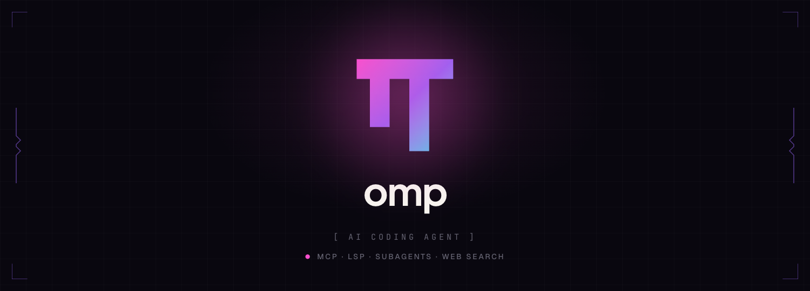

<p align="center">
  
</p>

<p align="center">
  <strong>A coding agent with the IDE wired in — rewritten in Rust.</strong><br>
  <strong><a href="https://omp.sh">omp.sh</a></strong>
</p>

<p align="center">
  <a href="LICENSE"></a>
  <a href="https://www.rust-lang.org"></a>
</p>

Pre-release: the workspace is being built up subsystem by subsystem; expect
renames and breaking changes without notice.

## Workspace layout

All crates live under `crates/*` (virtual workspace, resolver 3). Package
names are `omp-` prefixed; directory names are not.

### Core primitives

| Crate      | What it is                                                                                                   |
| ---------- | ------------------------------------------------------------------------------------------------------------ |
| `core`     | Compact strings/bytes (`Str`, `CowBytes`), sparse collections, binary↔text encodings, shared data structures |
| `ar`       | Bounded lazy ZIP/TAR/TAR.GZ reading, deterministic archive writing                                           |
| `walker`   | Filesystem traversal, filtering, file-candidate discovery                                                    |
| `slopjson` | Tolerant JSON for malformed, partial, and streaming documents                                                |
| `hashline` | Disk-free hashline patch parsing/application over immutable byte snapshots                                   |
| `ast`      | Tree-sitter source analysis, structural search, AST-aware editing                                            |

### Inference

| Crate           | What it is                                                                                                   |
| --------------- | ------------------------------------------------------------------------------------------------------------ |
| `llm-catalog`   | Typed offline provider/route/model/capability catalog (embedded snapshot, no runtime heuristics)             |
| `llm-inference` | Typed request/response contracts and `Client` over the Tower service stack (routing, auth, retries, budgets) |

### Services

| Crate       | What it is                                                                    |
| ----------- | ----------------------------------------------------------------------------- |
| `proto`     | Generated Protobuf messages and gRPC bindings for the wire protocols          |
| `rpc`       | gRPC transport, handshake, health, TLS, Unix-socket plumbing                  |
| `storage`   | Append-only session transcripts and content-addressed blob storage            |
| `docserver` | Local document authority: filesystem, revisions, transactions, watch, LSP ops |
| `telemetry` | OpenTelemetry instrumentation, metrics, export, redaction                     |
| `env`       | Typed client boundary for environment services                                |

### Agent

| Crate            | What it is                                                                           |
| ---------------- | ------------------------------------------------------------------------------------ |
| `tool` / `tools` | Typed revisioned tool contracts/registry, and the resource-owning built-in executors |
| `agent`          | Durable, interruptible agent-loop foundations                                        |
| `app`            | Production CLI application and daemon                                                |
| `e2e`            | Executable cross-crate acceptance proofs                                             |

### Shell

| Crate            | What it is                                               |
| ---------------- | -------------------------------------------------------- |
| `shell-engine`   | Standalone Bash parser and execution engine              |
| `shell-builtins` | In-process coreutils and process builtins (no fork/exec) |
| `shell`          | Facade combining engine and builtins                     |

### Interface

| Crate          | What it is                                                                    |
| -------------- | ----------------------------------------------------------------------------- |
| `tui`          | Retained-mode terminal UI: components, rendering, input, terminal integration |
| `tui-macros`   | `dom!` procedural markup macro for component trees                            |
| `gui`          | GPU-accelerated native window host for omp-tui apps                           |
| `py`           | Embedded free-threaded CPython runtime with frozen stdlib                     |
| `voice-kokoro` | Kokoro-82M text-to-speech on candle with Metal acceleration                   |

### Top level

| Path                  | What it is                                            |
| --------------------- | ----------------------------------------------------- |
| `PLAN.md`             | Agent-mesh plan index and decision record             |
| `docs/plan/`          | Per-phase design docs (contracts, loop, tools, proof) |
| `fixtures/llm-oracle` | Recorded inference fixtures                           |
| `npm/pi-coding-agent` | npm package shim (`scripts/gen-npm-packages.py`)      |
| `quirks/`             | Catalog/inference porting notes                       |
| `vendor/python`       | Gitignored embedded-Python build inputs (see below)   |

## Building

Pinned nightly toolchain via `rust-toolchain.toml`; edition 2024, hard-tab
formatting (`cargo fmt`), workspace lint policy in the root `Cargo.toml`.

```sh
cargo build            # or: cargo check / cargo test
```

The embedded-Python crate (`crates/py`) needs a one-time fetch before it
builds:

```sh
crates/py/scripts/fetch-python.sh
```

## Conventions

Dependency, allocation, async, and TUI-rendering rules are mandatory and
live in [`AGENTS.md`](AGENTS.md). Read it before touching anything.

## License

MIT
